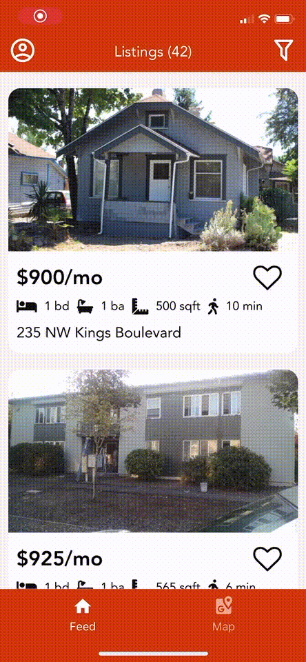

# Corvallis Off Campus

Finding an apartment in Corvallis should be easy. Corvallis Off Campus provides students the opportunity to browse through hundreds of listings for off campus apartments, all in one place.
 
 

Browse Listings | Map View | Filter Modal | Saved Listings
--------------- | -------- | ------------ | --------------
  |   |    |    

 

• Built with [React-Native](https://github.com/facebook/react-native) and [Expo](https://github.com/expo/expo) (Bare Workflow)

• Authentication built with Google [Firebase/Firestore](https://github.com/firebase/firebase-js-sdk).

• Listings sourced from [Custom API](https://github.com/FellowshipOfThePing/Corvallis-Off-Campus-API) (hosted on AWS)

• API fed with [Custom Data Scrapers](https://github.com/FellowshipOfThePing/Corvallis-Off-Campus-Scraper) (refreshing a MongoDB instance daily)

Version 0.1.0 currently in open beta on [TestFlight](https://testflight.apple.com/join/p6C1aSxG)
